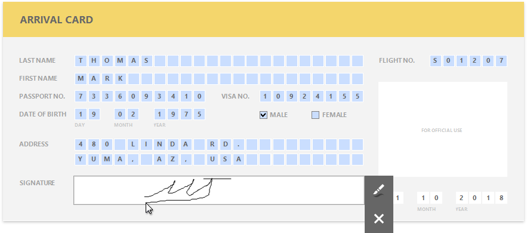
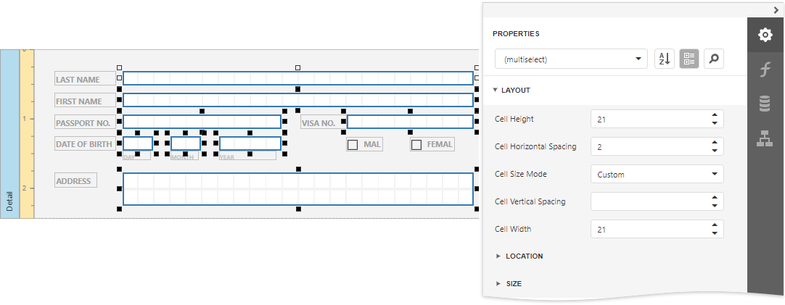

# Create an Interactive E-Form

This tutorial describes how to create an electronic form and make it fillable directly in Print Preview before printing or exporting it.

To get started with this tutorial, [create a new report](../add-new-reports.md) or [open an existing one](../open-reports.md).

## Add Form Fields

Add the [Label](../use-report-elements/use-basic-report-controls/label.md) controls to the report and arrange them according to the form's template. Set the labels' **Text** property to the form's field names.

## Add Fillable Cells

Use the [Character Comb](../use-report-elements/use-basic-report-controls/character-comb.md) control for the form's text fields. This control displays letters in individual cells and allows end users to fill these cells in Print Preview.

1. Drop the **Character Comb** item from the Toolbox onto the report.
	
	

2. Select all the added controls and set their properties in the [Properties](../../report-designer-tools/ui-panels/properties-panel.md) panel's **Layout** category:
	
	

3. Expand the **Behavior** category, select the **Edit Options** section and set the controls' **Enabled** property to **Yes** to enable content editing in Print Preview.
	
	

4. To display the watermark on the design surface, open the [Toolbar](../report-designer-tools/toolbar.md)'s **View** tab and enable the **Watermark** option.

	

The following image illustrates a report with a watermark providing a template of the preprinted form at design time.

## Add Check Box Editors

Add two [Check Box](../use-report-elements/use-basic-report-controls/check-box.md) controls to the report for selecting a gender. Then, change their text and appearance settings.

To enable switching check box states in Print Preview, expand the **Behavior** category, select the **Edit Options** and set the **Enabled** property to **Yes** as you did before. To allow selecting only one option at a time, combine these check boxes into a logical group by specifying the same value for the **Group ID** property.

## Add the Signature Editor

The next step is to provide the report with controls whose content should be customizable in preview mode.

1. Add the [Character Comb](../use-report-elements/use-basic-report-controls/character-comb.md) controls to the report for all required fields to allow entering characters in individual cells one by one.
		
	

2. Select all the added controls, clear their text and switch to the **Character Comb Tools** contextual toolbar tab. Adjust cell settings, such as **Width**, **Height**, **Horizontal Spacing**, etc.
	
	

3. Enable content editing in Print Preview for the same controls. Go to the [Property Grid](../report-designer-tools/ui-panels/property-grid.md), expand the **Edit Options** property and set the **Enabled** property to **Yes**.
	
	

4. For controls intended for entering letters only, invoke a drop-down list for the **Editor Name** property and select the required item from the **Letters** category to assign an editor with the corresponding mask.
	
	

5. To provide a mask for editing integer values, set the **Editor Name** property to **Integer Positive**
	
	

6. Add two [Check Box](../use-report-elements/use-basic-report-controls/check-box.md) controls to the report for selecting a gender. Then, change their text and appearance settings.
	
	

7. To enable switching check box states in Print Preview, set the **Edit Options** | **Enabled** property to **Yes** as you did before. To allow selecting only one option at a time, combine these check boxes into a logical group by specifying the same value for the **Group ID** property.
	
	

## Get the Result
The e-form report is now ready. Switch to [Print Preview](../preview-print-and-export-reports.md) to see the result.

To highlight all editing fields available in the form, click the  **Editing Fields** button on the Print Preview toolbar. Clicking a field invokes the appropriate editor. To apply the entered values and navigate between editing fields, use the TAB and SHIFT+TAB key combinations.

