# Introduction to Banded Reports

Banded reports provide a generalized report layout notion. When you preview a banded report, a report document is generated based on the report layout and data source.

## Report Bands

A report layout consists of bands that contain report controls and define their location on document pages. A blank report contains the following bands:

- The **Detail Band** displays recurring contents from the report's data source. This band is printed as many times as there are records available in a data source unless you filtered the data.

    Every report must have a detail band, and you cannot delete it.

- The top and bottom page **Margin bands**. These bands are repeated once on every document page.

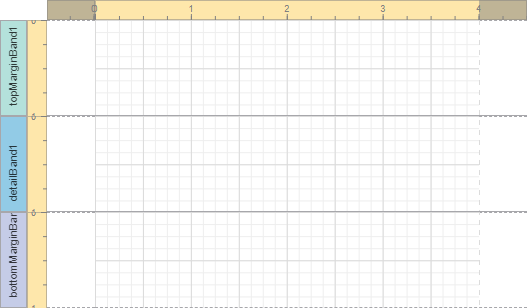

You can also add the following bands:

- **Report Header** and **Report Footer**  

    The **Report Header** is the report's first band (margins are "out-of-page" zones). Use this band to display the report's name, company logo, [date of creation, username](add-extra-information.md), etc.

    The **Report Footer** is placed before the Page Footer and Bottom Margin on the report's last page. You can use the Report Footer band for report [summaries](shape-report-data\shape-data-expression-bindings\calculate-a-summary.md) or conclusions.
    
- **Page Header** and **Page Footer**

    These bands are at the top and bottom of every page in a report. They display information that should be printed on every page.

- **Group Header** and **Group Footer**

    These bands are above and below each [group](shape-report-data\group-and-sort-data.md). The [Group and Sort Panel](report-designer-tools\ui-panels\group-and-sort-panel.md) create these bands automatically.

> [!TIP]
> Only the detail and group bands can be used to display dynamic data source contents. Other bands display titles, summaries, and [extra information](add-extra-information.md).

The following image illustrates a sample report layout and the [Report Explorer](report-designer-tools\ui-panels\report-explorer.md) panel that reflects the report's structure:

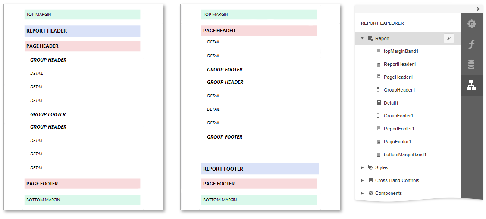

## Add a Detail Band to a Master-Detail Band

Use the **detail report band** to create hierarchical [master-detail reports](create-popular-reports/create-a-master-detail-report-use-detail-report-bands.md). Detail report bands provide detailed information about each record in the master report's detail band. You can create such reports when master-detail relationships are defined between data source tables:

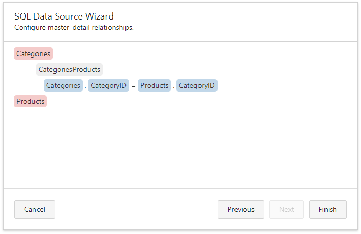

A detail report band is a separate report (subreport) with its own data source and different bands. A report can have any number of detail reports that can also be nested.

The following image illustrates a master-detail report and the [Report Explorer](report-designer-tools\ui-panels\report-explorer.md) panel that reflects the report's structure:

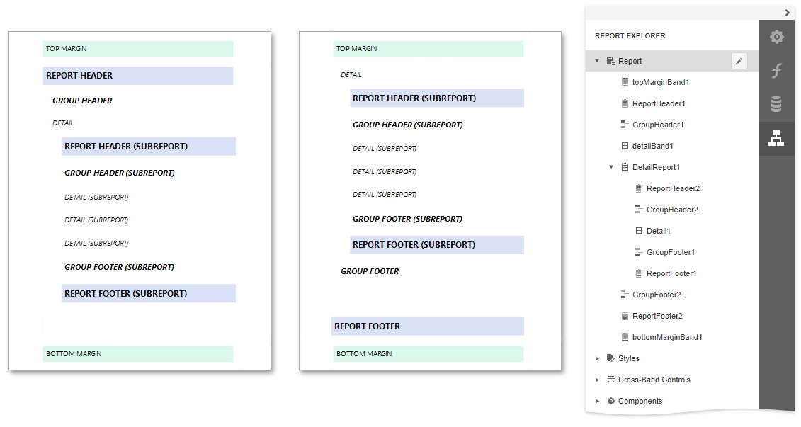

## Vertical Bands

You can replace the Detail band with the **Vertical Header**, **Vertical Detail** and **Vertical Total** bands to display record fields vertically and print data records horizontally - from left to right.

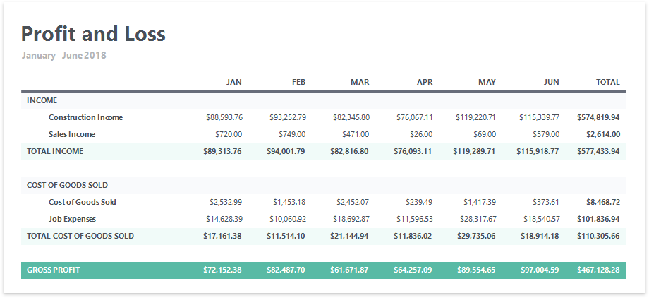

> [!NOTE]
> If your report's Detail band contains report controls, this band and all these controls are lost when you add a vertical band (the same behavior takes place in the opposite situation).

The following vertical bands are available:

- **Vertical Header**

    Contains headers of the report's data fields. These headers are arranged one after another in a vertical direction.

- **Vertical Details**

    Displays recurring contents from the report's data source. This band is printed as many times as there are available records in a data source, unless you filtered the data. The records are displayed one after another in a horizontal direction.

- **Vertical Total**

    This band is placed at the rightmost position (leftmost when RTL is enabled). You can use the Vertical Total band for report summaries or conclusions.

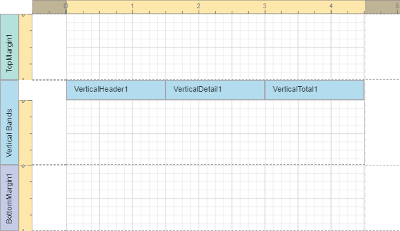

> [!TIP]
> See [Create a Vertical Report](create-popular-reports\create-a-vertical-report.md) for details on how to use vertical bands.

## Create Band Copies

You can create functional copies of a band, for example, to display different contents based on a specific condition. To do this, add **sub-bands** to bands.

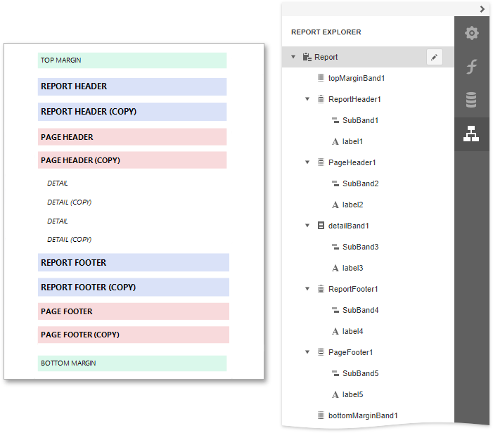

> [!TIP]
> See [Laying out Dynamic Report Contents](shape-report-data\lay-out-dynamic-report-content.md) for details on how to specify the location of bands' content on document pages.

## Manage Report Bands
### Hide Bands in the Report Designer

Select a band and click on the band's tab title to collapse or expand the band.

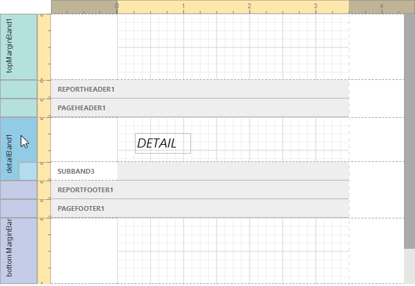

### Hide Bands in the Report Document

You can avoid printing a band's content in a document. To do this, set the band's **Visible** property to **false**. Select the band and set this property in the [Properties Panel](report-designer-tools/ui-panels/properties-panel.md).

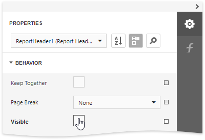

### Remove Bands

Select a band on the report design surface and press DELETE. This removes the band and all its content.

### Add Bands

To add a band, select the report or any of its bands in the **Properties** panel and click an appropriate item in the **Actions** category.

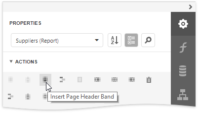

You can insert a detail report band if the report's data source has [master-detail relations](create-popular-reports/create-a-master-detail-report-use-detail-report-bands.md). Click **Insert Detail Report** in the **Actions** category.

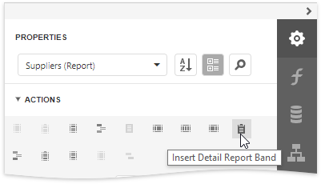
