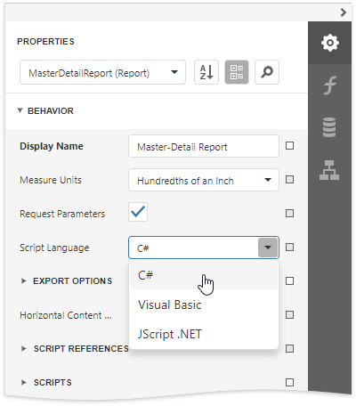
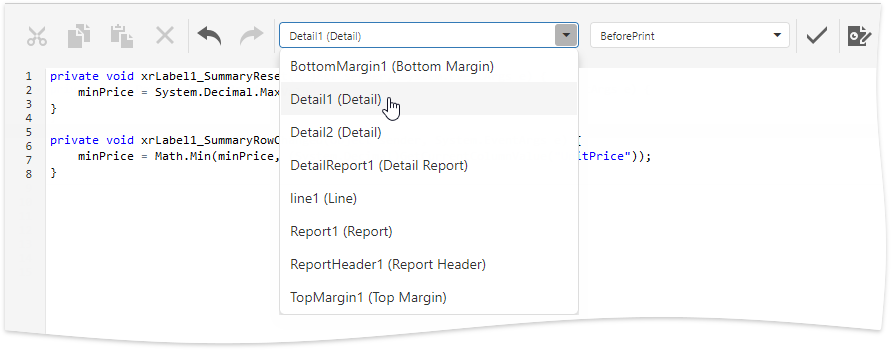

# Script Editor

> [!WARNING]
> Both the execution of all report scripts and the capability to view and edit scripts in the Web Report Designer are disabled by default for security reasons. Make sure that your software vendor allows you to use scripts.

The **Script Editor** allows you to write code for specific event handlers in the [End-User Report Designer](../../report-designer.md) to adjust the behavior of report controls, bands, or a report itself. This topic describes the basic principles of using scripts, the Script Editor interface and shows how scripting can be used in a report.

## Overview

_Scripts_ are program commands, placed within the _event handlers_ of the required report elements. And, when the corresponding event occurs (e.g. a mouse click), the script code runs.

You can write _scripts_ for a report or any of its elements (bands and controls), to be executed when the report is being [previewed, printed or exported](../preview-print-and-export-reports.md).

The Script Editor provides you the capability to write and execute scripts. Use this editor if you want to slightly customize a report in the End-User Report Designer.

The Script Editor supports **C#**, **Visual Basic .NET** and **JScript .NET** scripting languages. This means that the scripting language is independent from the language used to create the report. The language is specified by the **Script Language** property. The selected scripting language must be the same for all scripts used in a report.

The Script Editor supports intelligent code completion that makes it easier and faster to write scripts. Context-aware hints are displayed on pressing CTRL+spacebar. This feature is only supported for the **C#** and **Visual Basic .NET** script languages.

Intelligent code completion is available only for .NET Framework and DevExpress libraries deployed with the application and cannot be provided for custom assemblies.

## Maintaining Scripts

Each report element has its own set of events that can be handled by the Script Editor. To handle an event of a report element, do the following.

1. Click the **Scripts** button  located on the End-User Report Designer's [Main Toolbar](toolbar.md).
2. In the displayed Script Editor, specify the report control and its event by the toolbar. The toolbar contains all scripts written for all report elements, and allows you to quickly navigate through them by choosing the required report element in the corresponding drop-down list and specifying one of its available events in another menu.

    

    After the event is specified, a code template is generated in the current scripting language.

3. To check for errors in the report's script, click the **Validate** button (.

    If an error is found, the string containing this error is marked with an ( icon. When a mouse pointer hovers over this icon, the text of the error is displayed.

    
