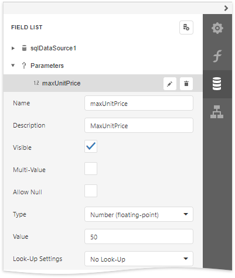
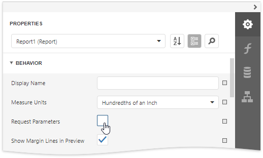
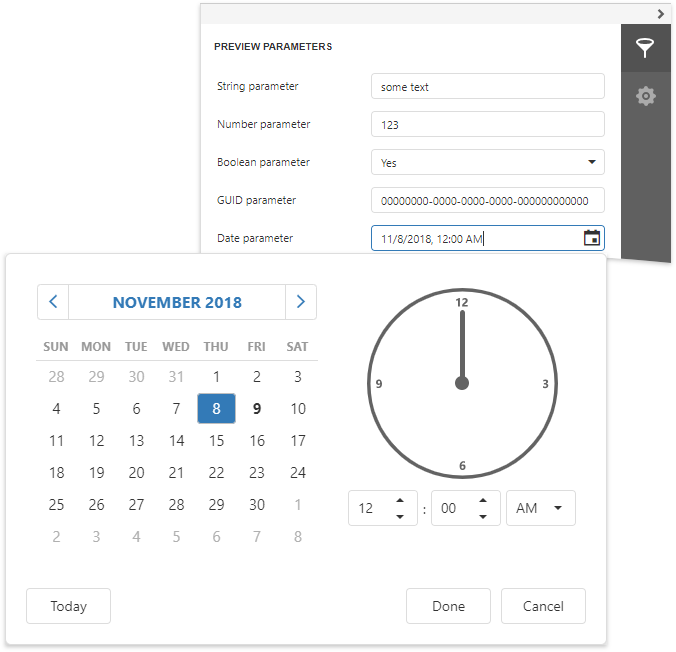
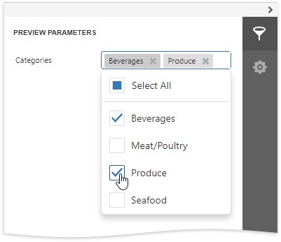

# Request and Pass Report Parameter Values

This document illustrates how to assign the default and custom values to a report's parameters and describes the editors that are used to request these values in a Print Preview.

## Requesting Parameter Values in a Print Preview
The parameter's **Value** property specifies the parameter's actual value. This value should correspond to the parameter's value type the **Type** property defines.

A parameter's value is not requested from end-users and is automatically passed to the report when the parameter's **Visible** property is set to **false**. When a report has at least one visible parameter, a Print Preview provides the **Parameters** panel for submitting parameter values.

When loading a Print Preview, a report document is not created by default unless values for all visible parameters are submitted. To create report documents without requesting parameter values (and using their default values instead), disable the report's **Request Parameters** property.

## Standard Parameter Editors

The parameter's **Type** property determines which values a parameter can accept. The corresponding value editors are created automatically for the following standard parameter types:

* String
* Date
* Number
	* 16-bit integer
	* 32-bit integer
	* 64-bit integer
	* floating point
	* double-precision floating point
	* decimal
* Boolean
* GUID (Globally Unique Identifier)

The following image illustrates the standard editors for parameter values:

## Look-Up Parameter Editors
You can list a parameter's values in a lookup editor:

* **Assign a Static List of Values to a Parameter**
	
	A parameter can be provided with a predefined set of static values, without creating a separate data source. Each value is accompanied by a description that appears in the Print Preview's user interface.
	
	
	
* **Assign a Dynamic List of Values to a Parameter**
	
	A parameter can obtain a list of values from a specified data source.
	
	

## Assign Multiple Values to a Parameter

A parameter can also be allowed to accept multiple values by enabling its **Multi-Value** property.

When creating cascading parameters, the list of values available for one parameter is filtered based on another parameter's current value. See [Create Multi-Value and Cascading Report Parameters](create-multi-value-and-cascading-parameters.md) for more information.